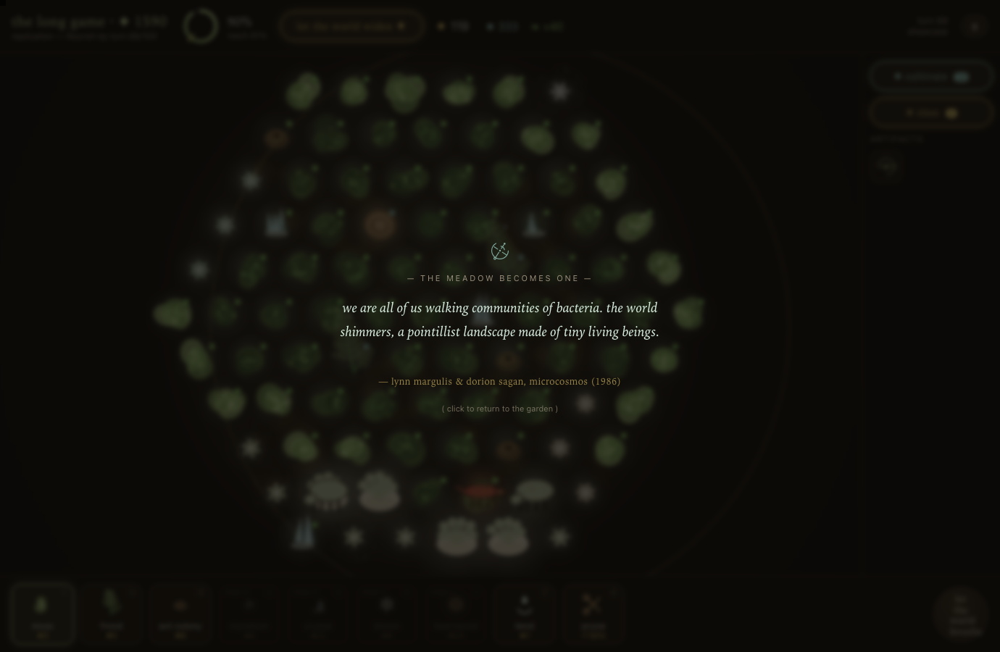

# loophole — a thermodynamic garden

> "decrease the total entropy of an isolated closed system without interfering with it from outside."
> there is no outside. that's the loophole.

A turn-based generative-art strategy game about entropy, consciousness, and our place in
both — vanilla HTML/Canvas/JS, zero dependencies, saves to localStorage.

**▶ play it: [booherbg.github.io/entropy-game-test/loophole](https://booherbg.github.io/entropy-game-test/loophole/)** — or just open [`loophole/index.html`](loophole/index.html) locally.

Plant self-replicating patterns — carpeting moss, fractal fronds, ant colonies that eat
disorder, mycelial networks, crystalline anchors, cellular-automata wildflowers, a pulsing
heartwood — across a living landscape of biomes, against the second law that seeps back every
turn. Read the soil, weave the synergies between neighbors, spend hoarded order on an
evolution tree, fight the creeping rot, and choose when to let the world widen. Gather the
murmurs — real human words, curated by the game's own hand. Wake the garden.

### then let a garden *keep going*

Choose **the long game** and there is no single waking — you tend a world toward turn 100, and **life
you never planted begins to arise from it.** Over-produce an element and a **flower** is summoned that
eats the excess, wearing its diet as its colour. Survivors establish into **beds**; a rich meadow draws
**grazing herds** and the **pollinators** that carry it; a grazer and the flower it has lived beside long
enough **merge into a coral** — *symbiogenesis*, Lynn Margulis's actual radical claim, a union that is
neither parent. An **apex** arrives to thin the herds, and the pressure drives *more* union. And when the
web grows cooperative enough, the meadow **becomes one** — a single living thing that recognises itself.

None of it is scripted. The food web, grown from real complexity science — Margulis, Prigogine, Kauffman,
Paine — argues its own way from competition to **Gaia**, and the flourishing score rewards the
cooperation, not the conquest. It closes where it began: a living world runs the gradient *down* faster
than bare rock, so the order you grew was disorder's own quickest path. *There is no outside.* The
loophole, resolved.

**v0.4 "the food web"** grows an emergent ecology atop the garden — flora summoned by your surpluses,
beds, grazing herds and pollinators, symbiogenic corals, an apex predator, and a meadow that can become
*one* — scored by a flourishing that rewards cooperation, and closed by a thermodynamic capstone drawn
from real non-equilibrium physics. The base garden beneath it (v0.2 "the living web": biomes, neighbor
synergies, a heat-capped economy feeding an evolution tree, motile blight, curated murmurs, a generative
soundtrack) stays intact. See [`loophole/README.md`](loophole/README.md).

- `loophole/` — the entire game (open `index.html`; no build, no server)
- `loophole/README.md` — how to play, publish, and develop
- `loophole/test/harness.js` — node test suite (bots, fuzzing, determinism, balance)
- `docs/superpowers/specs/` — the design document
