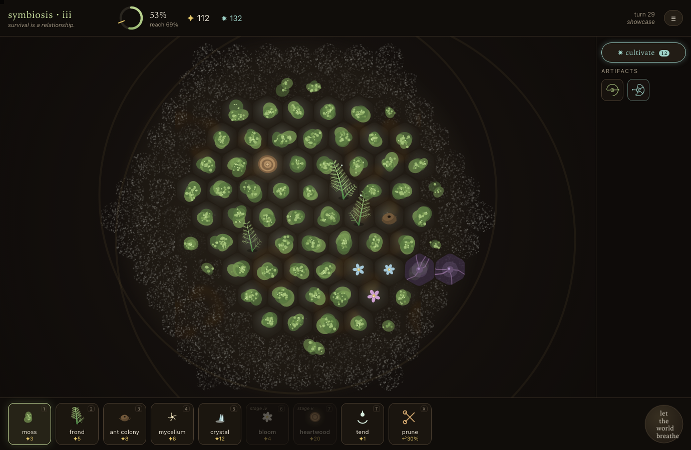
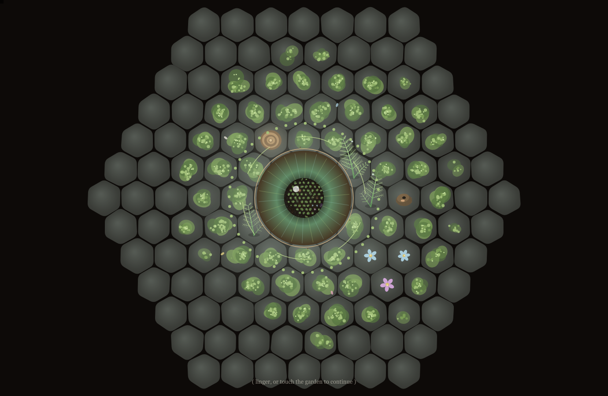

# loophole — a thermodynamic garden

> "decrease the total entropy of an isolated closed system without interfering with it from outside."
> there is no outside. that's the loophole.

A turn-based generative-art strategy game about entropy, consciousness, and our place in
both — vanilla HTML/Canvas/JS, zero dependencies, saves to localStorage.

**▶ play it: [booherbg.github.io/entropy-game-test/loophole](https://booherbg.github.io/entropy-game-test/loophole/)** — or just open [`loophole/index.html`](loophole/index.html) locally.

Plant self-replicating patterns — carpeting moss, fractal fronds, ant colonies that eat
disorder, mycelial networks, crystalline anchors, cellular-automata wildflowers, a pulsing
heartwood — across a living landscape of biomes, against the second law that seeps back every
turn. Read the soil, weave the synergies between neighbors, spend hoarded order on an
evolution tree, fight the creeping rot, and choose when to let the world widen. Gather the
murmurs — real human words, curated by the game's own hand. Wake the garden.

**v0.2 "the living web"** adds biomes, neighbor synergies, a heat-capped economy that feeds an
evolution tree, motile blight, an upgraded storm, drag-to-paint, a stats graph, real-quote
murmurs, and a generative soundtrack. See [`loophole/README.md`](loophole/README.md).

- `loophole/` — the entire game (open `index.html`; no build, no server)
- `loophole/README.md` — how to play, publish, and develop
- `loophole/test/harness.js` — node test suite (bots, fuzzing, determinism, balance)
- `docs/superpowers/specs/` — the design document
