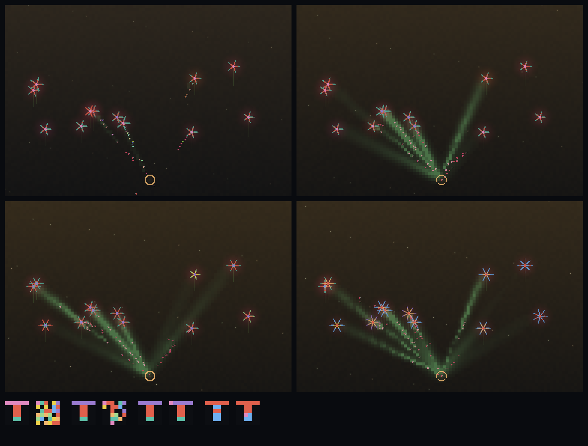

# bloom

*a pixel-art garden where you coax a flowering mother tree and a colony of pollinators into a co-evolving
symbiosis — and watch natural selection sculpt a random, fumbling lock-and-key into an exquisitely-fit pair
before your eyes.*

A factory whose machines are alive. Determinism gives legibility; mutation gives wonder; the same system
gives both. Vanilla HTML/Canvas/JS, zero dependencies, saves to localStorage.

**▶ Play it live:** https://blainebooher.com/entropy-game-test/bloom/ (or https://booherbg.github.io/entropy-game-test/bloom/)
— the world breathes on its own; pause to make weighed moves. Add `?warp=2500` to skip ahead to a merged
garden, or `#seed=42` to grow a specific one (the same seed always grows the same garden).

- **▶ HANDOFF (start here to pick this up):** `docs/2026-07-01-handoff.md` — the authoritative current-state doc.
- **Design spec:** `../docs/superpowers/specs/2026-06-30-bloom-plant-pollinator-prototype-design.md`
- **Live mechanisms reference:** `../docs/bloom-mechanisms.html`
- **Build plan:** `../docs/superpowers/plans/2026-06-30-bloom-prototype.md`
- **Critiques + loop roadmap:** `docs/2026-06-30-critique-simcity.md`, `docs/2026-06-30-loop-roadmap.md`

## The merge, in one image



*Four moments (fumbling → native) over a filmstrip of the flower's maze (left) and the colony's key (right)
drifting from totally different into the same pattern — selection alone, nobody painting them.*

## Run the tests
```
node bloom/test/harness.js     # 73 deterministic assertions on the deep behaviours
node bloom/test/soul.js        # THE soul test: the fumbling pair co-adapts into a matched lock-and-key (5 seeds)
node bloom/test/shot.js 2500 merged   # headless PNG of the world → bloom/shots/
node bloom/test/timelapse.js 7        # the merge filmstrip above
```

## Play
Open `bloom/index.html` in a browser. The world breathes on its own; pause to make weighed moves.

*Lineage: LOOPHOLE → eddy → bloom. eddy's sim discipline (conserved field, seeded RNG, node-test harness)
is a reference, not a dependency.*
